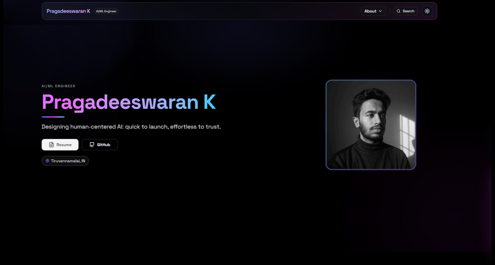
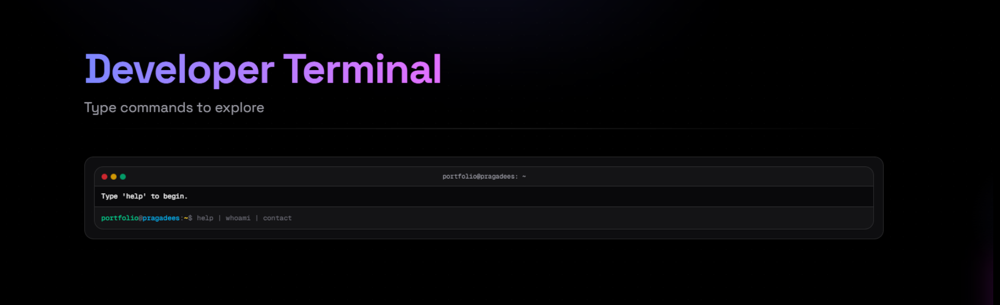
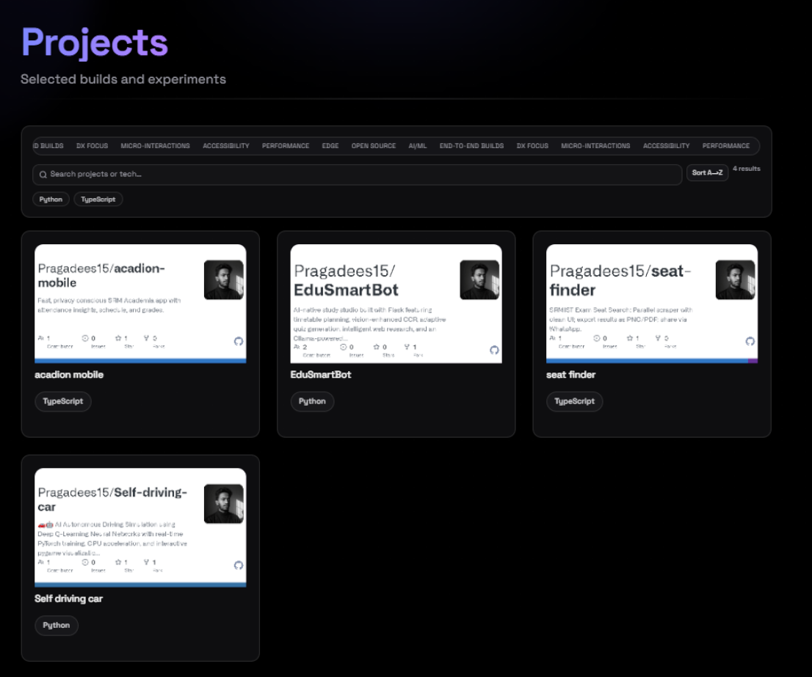
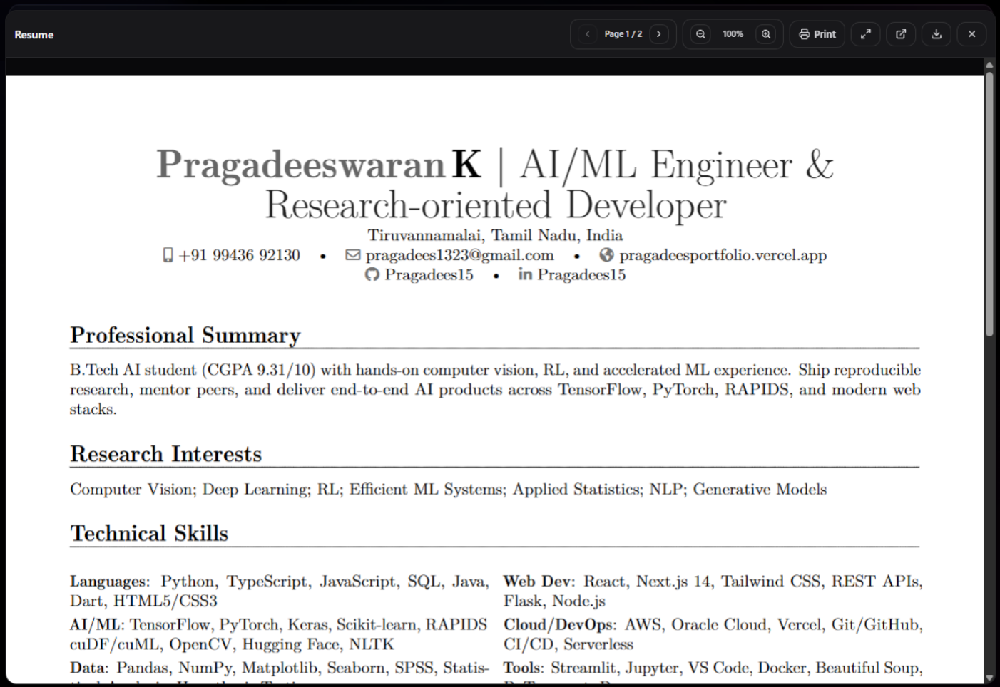

<div align="center">

# Pragadeeswaran K  
### AI/ML Engineer · Personal Launch Site

```
╔═══════════════════════════════════════╗
║  Human-centered AI storytelling stack ║
║  Designed for recruiters + builders   ║
║  Crafted like a product launch site   ║
╚═══════════════════════════════════════╝
```

[](https://git.io/typing-svg)


[](https://nextjs.org/)
[](https://www.typescriptlang.org/)
[](https://tailwindcss.com/)
[](https://vercel.com/)
[](./LICENSE)

<br />


<br />
<sub>Gradient hero · Retro terminal · GitHub-powered projects grid · Contact CTA</sub>


</div>

---

## ⚡ TL;DR

- **Live**: `https://pragadeesportfolio.vercel.app`  
- **Core vibe**: feels like a **product launch** for *you* as an AI/ML engineer.  
- **Stack**: Next.js 16 · Tailwind 4 · React Server Components · Edge-ready APIs.  
- **Experience**: motion-rich hero, dev terminal, command palette, GitHub-powered projects, resume viewer.  
- **Signal**: recruiter-friendly story arc, SEO + JSON-LD + OG cards tuned for quick scanning.  

```text
Recruiter flow:  Hero → Skills / Social proof → Projects → Experience → Resume → Contact
Builder flow:    Hero → Terminal / Command palette → Source → API routes → Animations
```

---

## 🎛️ Experience Console

<p align="center">
  
</p>

| Surface | Why it exists | Tech spark |
| --- | --- | --- |
| **Hero + Social Proof** | AI/ML elevator pitch with trust signals up top | Gradient orchestration, staggered copy, GitHub avatar |
| **Developer Terminal** | Easter egg for builders, also doubles as guided nav | Faux prompt, typing loop, quick command buttons |
| **Command Palette** | Recruiters jump to resume, contact, case studies in two keystrokes | `cmd+k` overlay with fuzzy actions |
| **Projects Grid** | GitHub-synced cards with OG previews and quick stats | `src/lib/github.ts`, cached fetch, OG image API |
| **Resume + Honors** | Scroll-stopping PDF viewer + badges | `react-pdf`, highlight pills, timeline |
| **Contact CTA** | Frictionless outreach with spam-safe proxy | `/api/contact` + FormSubmit inbox handoff |

<details>
<summary><strong>Animation breakdown</strong></summary>

1. Layered gradient hero, avatar pulse, dual CTAs  
2. Skill chips + social proof logos drifting upward  
3. Retro terminal slides in, command palette flashes on keypress  
4. Projects grid floats in with hover lift + OG thumbnails  
5. Resume viewer + contact glass card close the loop

</details>

---

## 🧬 Design DNA


> **Design goals**  
> ✨ Feel like a polished product, not a template  
> 🧪 Showcase taste in motion, typography, and systems thinking  
> ♿ Stay accessible even with neon / dark visuals  

| Layer | Ingredients | Notes |
| --- | --- | --- |
| **Color** | `#0b0b0f` base, neon indigo → fuchsia → cyan gradient | Conic bursts clipped with radial masks, dotted grid overlay |
| **Type** | Space Grotesk (display), Geist Mono (terminal), system sans fallback | Loaded via Next Fonts to avoid FOIT |
| **Components** | Glass panels, neon separators, rounded 16px radius, hyper glow toggles | Variants powered by `class-variance-authority` |
| **Motion** | Framer Motion (stagger, reveal), GSAP (ambient orbs), CSS scroll smoothing | Scroll sensors inside `components/Reveal` |
| **Accessibility** | Dark mode contrast tokens, decorative particles marked `aria-hidden` | High-contrast toggles tuned for neon-on-black |

```text
Tone sliders:
Minimal ◀─────────────●──── Maximal
Static  ◀────●──────────────── Animated
Playful ◀────────●──────────── Serious
```

---

## 🏗️ Systems Map

```
src/
├─ app/
│  ├─ page.tsx          // Section composition + reveal choreography
│  ├─ layout.tsx        // Fonts, metadata, ThemeProvider, JSON-LD
│  ├─ api/
│  │  ├─ contact/route  // FormSubmit proxy with honeypot + dwell guard
│  │  └─ github-og/     // Dynamic OG cards for project shots
│  └─ (seo routes)      // opengraph-image, twitter-image, resume OGs
├─ sections/            // Hero, Terminal, SocialProof, Projects, etc.
├─ components/          // CommandPalette, HyperModeToggle, Reveal
├─ data/                // profile/resume matrices
└─ lib/github.ts        // Repo fetcher + caching strat
```

```text
[GitHub API] → lib/github.ts → sections/Projects → /api/github-og → OG images
[Profile/Resume data] → data/* → sections/* → app/page.tsx
[Forms] → /api/contact → FormSubmit → Inbox
```

---

## 🔥 Tech Stack

| Layer | Tools | Why it’s here |
| --- | --- | --- |
| **Framework** | Next.js 16, React 19, App Router | SSR, RSC, SEO, and file-based routing out of the box |
| **Styling** | Tailwind 4, Tailwind Merge, `globals.css` tokens | Fast iteration with a coherent design system |
| **Content** | `src/data/profile.ts`, `src/data/resume.ts` | All key narrative content in one place |
| **Animation** | Framer Motion, GSAP, intersection observers | Fine-grained control of reveals and ambient motion |
| **Docs / Media** | `react-pdf`, `pdfjs-dist`, custom OG | Rich resume & link previews without leaving the page |
| **DX / Tooling** | TypeScript 5, ESLint 9, `next-sitemap`, clsx, cva | Safety, consistency, and automated SEO artifacts |
| **Deploy** | Vercel, Node-compatible build | Click-deploy, but portable if you need another host |

---

## 📟 Launch Checklist

| Task | Command |
| --- | --- |
| Clone repo | `git clone https://github.com/Pragadees15/personal-portfolio.git && cd personal-portfolio` |
| Install deps | `npm install` |
| Start dev server | `npm run dev` (visit `http://localhost:3000`) |
| Production build | `npm run build` |
| Preview build | `npm start` |
| Lint | `npm run lint` |
| Sitemap | `npm run postbuild` (runs `next-sitemap`) |

```text
Local → Lint-clean → Production build → Deploy → Postbuild sitemap
   ✅        ✅              ✅             🚀            🗺️
```

---

## 🔐 Environment Blueprint

| Variable | Purpose | Sample |
| --- | --- | --- |
| `NEXT_PUBLIC_SITE_URL` | Canonical URL for metadata & OG | `https://your-domain.com` |
| `FORMSUBMIT_EMAIL` | FormSubmit inbox target | `you@example.com` |
| `GITHUB_TOKEN` | Optional token for GitHub API headroom | `ghp_example` |

Create `.env.local`:

```bash
NEXT_PUBLIC_SITE_URL=https://your-domain.com
FORMSUBMIT_EMAIL=you@example.com
GITHUB_TOKEN=ghp_example
```

> Already ignored via `.gitignore`. Keep secrets local.

---

## 🖼️ Screens

<div align="center">

| Hero | Terminal |
| --- | --- |
|  |  |

| Projects | Resume |
| --- | --- |
|  |  |

</div>

---

## 📄 License

MIT — see `LICENSE`. Fork, remix, give credit where it helps.


